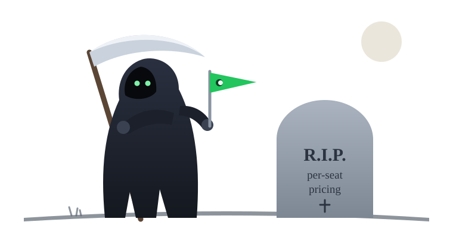

# SaaS Reaper

<p align="center">
  
</p>

SaaS Reaper composes customer choices into a complete, customer-owned SaaS
capability repository — and then it walks away. The generated service does not
call home, does not renew, and has no vendor left to outlive. This proof of
concept contains both sides of that bargain: the configurator/generator and
the original Go feature-flags golden specimen used to establish the behavior
and engineering boundary.

## Generate a product

Use the interactive configurator:

```sh
go run ./cmd/reaper new
```

Or open the local browser product and download the composed ZIP:

```sh
go run ./cmd/reaper serve
# open http://127.0.0.1:8090
```

Or generate deterministically from a recipe:

```sh
go run ./cmd/reaper catalog
go run ./cmd/reaper generate \
  --recipe recipes/go-sqlite-docker.yaml \
  --out /tmp/acme-flags
```

The customer chooses Go, TypeScript, or Python; SQLite, PostgreSQL, MongoDB,
or Couchbase; a deployment pack; and directory/ZIP delivery. Reaper validates
compatibility, renders only the selected mechanisms, and returns an independent repository
containing the service, infrastructure, `AGENTS.md`, `CLAUDE.md`, `DOMAIN.md`,
`WORK.md`, skills, receipt, checks, and demo. Generation never provisions
infrastructure and generated services do not call home.

Supported deployment packs are Docker Compose, AWS ECS/Fargate, AWS EC2, GCP
Cloud Run, and Kubernetes/Kustomize. Managed and multi-replica targets require
a shared authority (PostgreSQL, MongoDB, or Couchbase); unsafe SQLite
combinations are
rejected before rendering.

Run the factory proof:

```sh
make product-demo
```

## Golden specimens

The root Go service remains the first customer-owned specimen. It asks whether
a small SaaS capability can arrive runnable, understandable, and safe for an
agent to adapt to a customer's domain.

Prerequisites: Go 1.25 or newer, Node.js 24 or newer with npm, Python 3.11 or
newer, Bash, ShellCheck, `curl`, `jq`, and `rsync`. The product demo also uses
Docker Compose, Terraform 1.8 or newer, and `unzip`. The golden demo binds
loopback port `18080` and uses a temporary database. Go-pinned tooling supplies
the remaining linters.

Run the complete demo:

```sh
make demo
```

The command installs pinned Go, TypeScript, and Python dependencies, starts the appliance against a temporary SQLite database, publishes one flag, and proves the same OpenFeature evaluation from all three consumer languages for a rule match, rollout match, and rollout miss.

Run the validation floor:

```sh
make check
```

The second specimen lives in
[`specimens/webhook-delivery`](specimens/webhook-delivery). Outbound webhook
delivery fits the Reaper's selection rule unusually well: it is sold like
infrastructure even though the essential product is an HTTP POST, an HMAC
signature, durable state, and a bounded retry loop. The independent nested Go
module keeps that capability adjacent to the future factory source without
pretending the factory supports it today—`validate.go` still rejects every
capability except `feature-flags`. Its local proof sends real deliveries to
receivers using the official Standard Webhooks Go, JavaScript, and Python
verifier libraries, including a signature-tamper rejection in each language.
The receivers also compare Base64 of the received body to the literal fixture,
so equivalent JSON reserialization cannot satisfy the exact-byte proof.

Run the webhook proofs without external runtime traffic:

```sh
make setup # install the pinned verifier libraries once
make webhook-demo
make webhook-invariants
# static checks plus both runnable proofs
make webhook-proof
```

## Frontier work contract

Every generated repository includes a tailored `WORK.md`: a compact active-work
packet with an exact generation subject, one outcome, protected invariants,
permitted paths, green and red proof obligations, stop conditions, evidence,
and a resumable handoff. It is deliberately not another agent manual.

`make work` validates the contract and emits a small JSON summary. `make check`
runs the same validation before language checks. See
[docs/work-contract.md](docs/work-contract.md) for the bounded schema and its
honesty limits.

## Contributing

See [CONTRIBUTING.md](CONTRIBUTING.md) for the executable option-extension
contract and concrete recipes for adding a language, database, deployment, or
delivery format. The catalog and template pack directories must agree exactly;
the complete render matrix and product demo prevent half-registered choices
from shipping.

The validation includes a bounded domain-adaptation control: in a temporary copy, it follows the shipped skill to approve `organization.plan`, updates only domain policy/docs/tests, and proves the new targeting rule without coupling API or storage. The shipped specimen remains unchanged.

Agent skills have one canonical body under `skills/`. Relative symlinks project them into `.agents/skills/` for Codex and `.claude/skills/` for Claude; validation fails if either projection is missing or drifted.

## Boundaries

```text
management HTTP ──┐
                  ▼
              internal/flags ──► store contract ──► SQLite
                  │
OFREP HTTP ───────┤
                  ▼
             snapshot contract ──► memory projection
```

- `internal/flags` owns flag validation, ordered rule evaluation, deterministic rollout policy, revision conflicts, and the narrow interfaces it consumes.
- `internal/api` translates management JSON and OFREP 0.3.0 HTTP. It does not decide flag behavior.
- `internal/store/sqlite` persists authoritative definitions and the append-only audit in one transaction.
- `internal/snapshot` serves copied, already-validated flags from memory.
- `cmd/reaper-flags/main.go` is the composition root.

Packages name the responsibility they own. Files name concrete concepts or operations. `model.go`, `types.go`, `utils.go`, and similar buckets are rejected by `scripts/check-boundaries.sh`, which also rejects `else` and inward dependency leaks.

## Evaluation contract

The OFREP base URL is environment-scoped:

```text
http://host:port/environments/{environment}
```

The standard provider appends `/ofrep/v1/evaluate/flags/{key}`. Dotted targeting attributes such as `organization.id` are flat evaluation-context keys on the wire, exactly as OpenFeature providers send them — never nested objects. Evaluation order is fixed:

1. A disabled flag returns its default variant.
2. Rules are checked in declaration order.
3. The optional rollout hashes `flag-key + NUL + targeting-value` with SHA-256 and maps the first unsigned 64 bits into 10,000 buckets.
4. A rollout miss returns the default variant.

The POC supports boolean and string flags, equality rules, `targetingKey`, and `organization.id`. The bounded surface and explicit exclusions are recorded in `REAPER.yaml`.

## Management contract

Publish a flag with optimistic concurrency:

```text
PUT /v1/environments/{environment}/flags/{key}
Authorization: Bearer $REAPER_ADMIN_TOKEN

{
  "expectedRevision": 0,
  "flag": { ... }
}
```

Creating requires revision `0`; updating requires the current revision. SQLite commits the new definition and its audit event atomically. The audit actor comes from the authenticated server principal in `REAPER_ADMIN_ACTOR`, never from request JSON. Evaluation uses a separate `REAPER_EVALUATION_TOKEN`.

## Honest POC boundary

The factory currently offers a CLI and a local browser configurator, not a
hosted multi-user control plane. It generates Go, TypeScript, and Python service
packs. Each pack is intentionally smaller than the root golden specimen: it
keeps the same evaluation and revision policy without the golden specimen's
separate in-memory read projection, and it serves only health, management
publish, the audit read, and OFREP single-flag evaluation. Flag listing and
OFREP bulk evaluation remain specimen-only; the gap is recorded in
`REAPER.yaml` and each generated README. Two cross-language harnesses in
`make product-demo` guard every generated SQLite service: one drives the real
OpenFeature Go, TypeScript, and Python clients through the specimen's scenario
table and the audit read, the other proves the store and API invariants
black-box — stale-revision rejection, one winner under concurrent creation,
authentication separation, one audit row per publish, and survival of
definitions and audit across a service restart. PostgreSQL and MongoDB packs
compile and check in the demo without a live database; the MongoDB packs
additionally carry a documented container-backed run of both harnesses
(`docs/mongodb-live-proof.md`).
Cloud templates are delivered for review
but are never applied by Reaper. Managed PostgreSQL and MongoDB instances, domains,
certificates, container registries, and secret values remain explicit customer
inputs.

The generated capability does not yet include an admin UI, client-side/local
evaluation, approvals, analytics, an identity provider, per-environment
credential scopes, token rotation, or a general rule language. Those are
post-proof product questions, not hidden promises.

## License

[MIT](LICENSE). The Reaper asks for nothing in return. It already took what
it came for.
